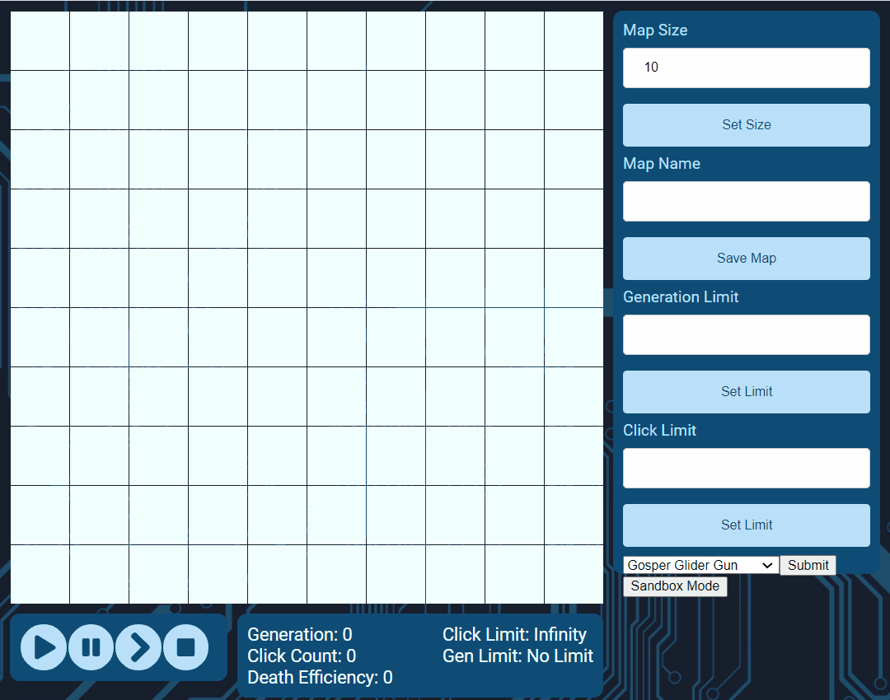

[](https://travis-ci.org/Hyan18/the-css)

# Mind over cells

[Description](#description) | [Demo](#demo) | [Approach](#approach) | [Technologies Used](#technologies-used) | [Tests](#tests) | [Getting Started](#getting-started) | [How to Run the App](#how-to-run-the-app) | [How to Run the tests](#how-to-run-the-tests) | [Todo](#Todo)

## Description

A web-app that builds upon Joseph Conway's Game of Life ([Wikipedia](https://en.wikipedia.org/wiki/Conway%27s_Game_of_Life). Cells live, die or come to life depending on a set of predefined rules. These rules are:

1. Any live cell with two or three live neighbours survives.
2. Any dead cell with three live neighbours becomes a live cell.
3. All other live cells die in the next generation. Similarly, all other dead cells stay dead.

We have built upon these rules and added features allowing users to do things such as:

1. Customise the map size.
2. Save initial starting states.
3. Load user-made starting states.
4. Limit the initial clicks.
5. View the generation limit.
6. View the death efficiency score.

Using these added features users can create their own games. For example, given a limit of clicks, how many cells can stay alive at the end of the generation limit?

## Demo

Checkout our hosted website [here](https://the-css.herokuapp.com/).



## Approach

Our team used an agile workflow with short sprints, stand-ups, retros to deliver features in pairs. Code was then reviewed by the remaining team members before being automatically deployed by TravisCI. We followed strict TDD, ensured ~ 100% test coverage and included feature tests, unit tests, api endpoint tests using supertest, jest and enzyme. We used Trello to keep organised and estimate times so deadlines could be met. We used User stories to increment our app driven by user needs / requirements.

**User stories:**

```
As a user
So that I know what is going on
I want to see a grid of cells

As a user
So I know the state of the cell
I want the cells to have different colours

As a user
So I can decide when the game begins
I want to be able to press a play button

As a user
So I can decide when the game ends
I want to be able to press a stop button

As a user
So I can decide when the game iterates
I want to be able to press a step button

As a user
So I can observe the simulation
I want it to follow Conway's Game of Life

As a user
So I can set the initial state
I want to be able to click on a cell to set it's state
```

## Technologies Used

**Main:**

- [MongoDB](https://mongodb.com) - The database.
- [Express](https://expressjs.com/) - The backend server.
- [React](https://reactjs.org/) - The frontend framework.
- [Node](https://nodejs.org/) - The backend environment.

**Additional**: Jest, TravisCI, Enzyme, Eslint, Prettier, Supertest, CodeClimate, git

## Tests

- ~100% coverage achieved.
- Feature test example:

## Getting Started

For local development:

```
$ git clone git@github.com:Hyan18/the-css.git
$ yarn install
$ yarn --cwd client install
```

## How to Run the app

`$ yarn dev`

## How to Run the tests

To run the jest/enzyme tests for React, the jest/supertest tests for Express and the coverage:

```

$ yarn run test
$ yarn run coverage-server
\$ yarn run coverage-client

```

To run the linter:

`$ yarn run lint`

## Authors

- [Dawid Szpener](https://github.com/DawidSzpener)

- [Harrison Yan](https://github.com/Hyan18)

- [Harry Mumford](https://github.com/HarryMumford)

- [Jamie Wong](https://github.com/Jamie95187)

- [Alastair Gilles](https://github.com/ffgi-es)

## License

This project is licensed under the MIT License - see the [LICENSE.md](LICENSE.md) file for details

## Acknowledgments

- Cheers Conway for inspiring us to build this beautiful project.
- etc
